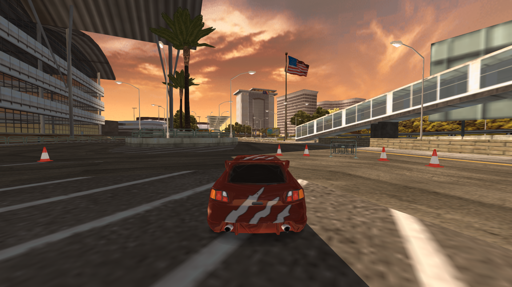
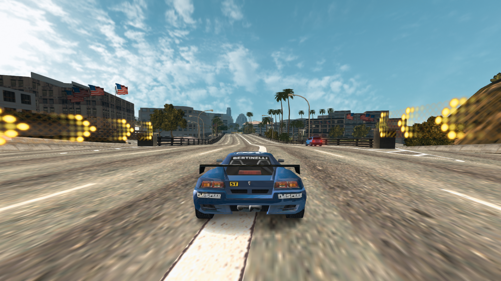
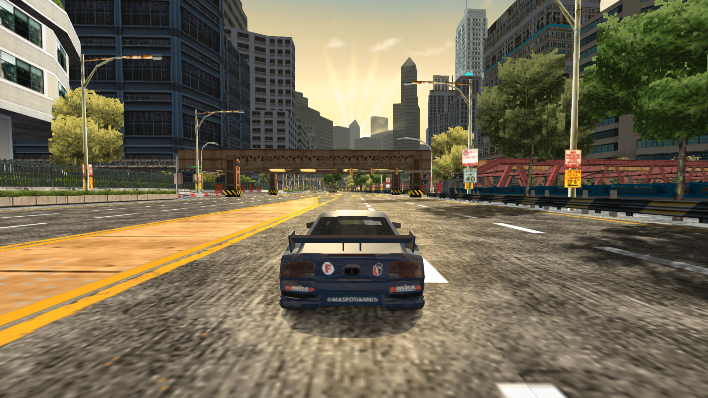
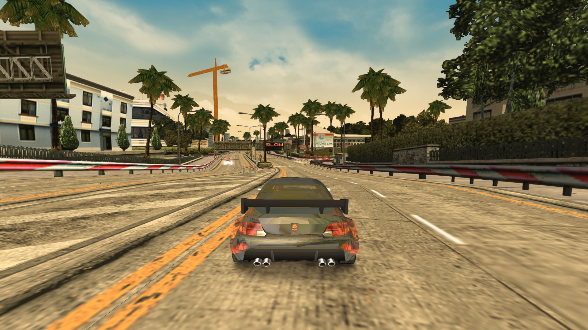
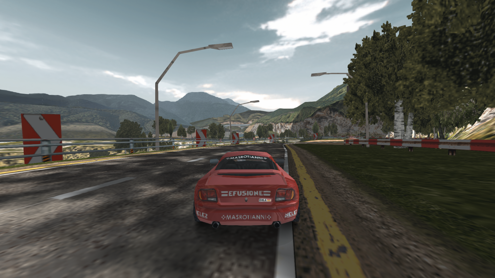
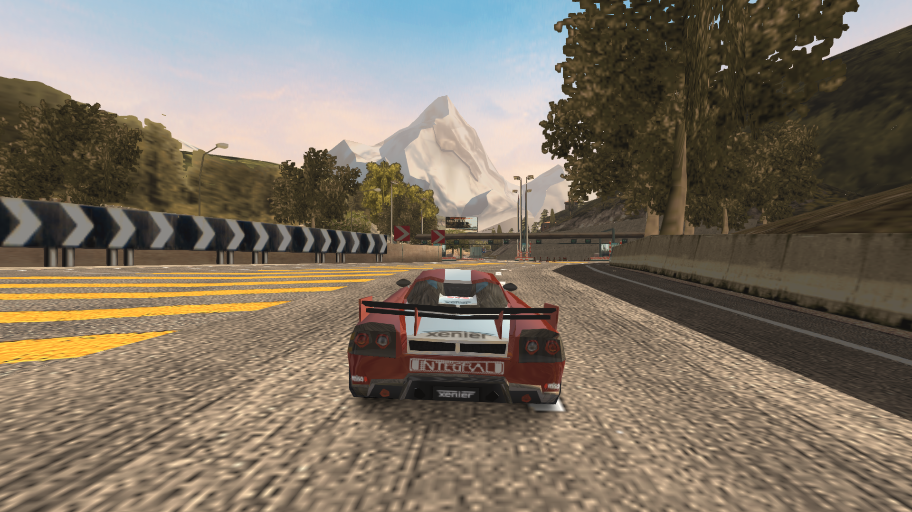
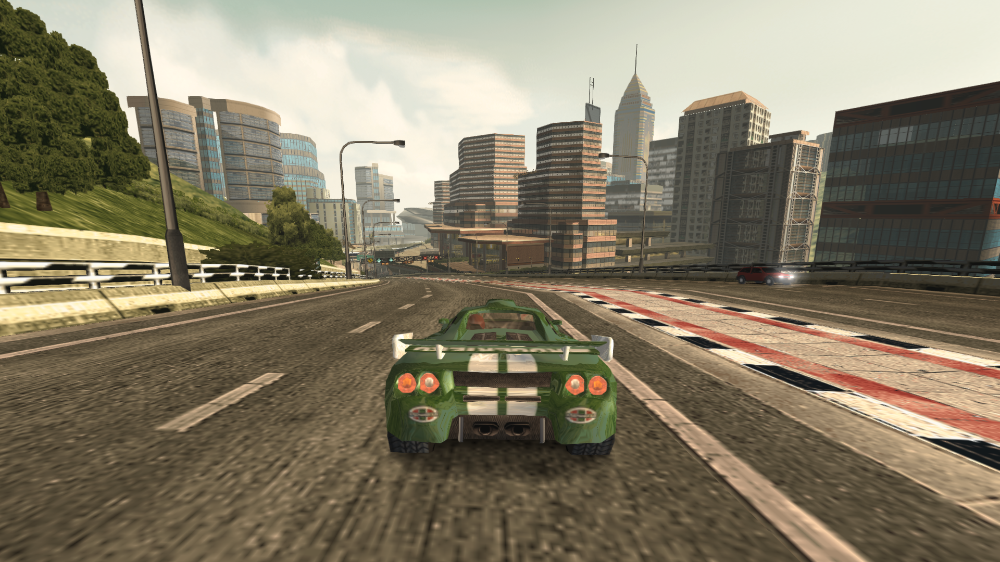

# Burnout-Legends-Better-Skies
by TheGoat07s

Perhaps the intended look for Burnout Legends

Better Skies for Burnout Legends is a modification that aims to improve the overall visuals of the game without drifting too far from the game's original look.

One of the reasons for Burnout Legends' subpar visuals, even for a PSP game, is that the skyboxes do not match the lighting of the track/level or the other way around: the track do not match the lighting of the sky. Additionally, lighting on vehicles appears to be stationary: always behind the player vehicle and not positioned where the sun is supposed to be.

Features:

* PS2-like skyboxes
* Directional lighting on vehicles
* More visible distant fog
* New reflection map for the garage

> [!IMPORTANT]
> This mod is intended for PPSSPP
> 
> Only tested on ULUS10025 and ULES00125
> 
> Installation:
> 
> * Using your preferred .iso editor (e.g. UMDGen), simply drag and drop the "PSP_GAME" folder into the game directory, then save a new .iso file.
> 
> * In the PPSSPP directory, drag and drop the folder "ULUS10025" or "ULES00125" (check your game version) into "memstick/PSP/TEXTURES".
> 
> In PPSSPP:
> 
> * Enable "Replace textures", found in "Game settings/Tools/Developer tools/Texture replacement".
> 
> * Navigate to "Display layout & effects" then add "PSP Color". This will reduce the yellow-green tint of the game. See comparison below:
> 
> Before (Without PSP Color)
> 
> 
> After (With PSP Color)
> 
> 
> This is a matter of preference but the intended look of the mod has this filter applied.

### Screenshots
USA

Europe

Far East

